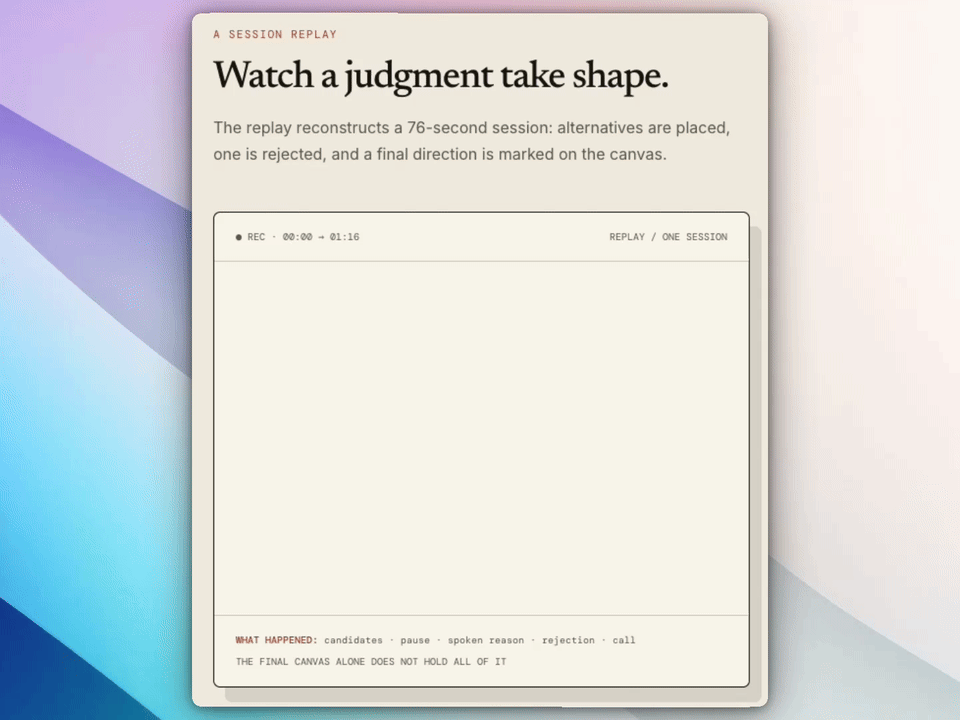

<p align="center">
  <picture>
    <source media="(prefers-color-scheme: dark)" srcset="./assets/logo-dark.svg">
    
  </picture>
</p>

<h1 align="center">Canvas Prompt</h1>

<p align="center">
  <a href="https://github.com/dlxeva/canvas-prompt/blob/main/.codex-plugin/plugin.json"></a>
  <a href="https://github.com/dlxeva/canvas-prompt/actions/workflows/verify.yml"></a>
  
  
  <a href="./LICENSE">
</p>

<p align="center"><strong>让 AI 看见该改哪里。</strong></p>

<p align="center">在你指向的地方，说出你的意思。</p>

<p align="center">圈出来 · 说出来 · 继续推进</p>

<p align="center">简体中文 · <a href="./README.md">English</a></p>

很多工作发生在一句清晰提示词之前：一个还没画完的结构、一张被圈出两个细节的图片、说到一半改了方向的话、停在你所指对象上的光标。Canvas Prompt 给这些过程一块本地画布。

你可以自然地画、圈、移动、粘贴和讲述。一轮结束时，Canvas Prompt 会把**最后的画面，以及它如何形成的过程**编译成保存在设备上的 Prompt Package。AI 读到的不只是截图；它还能区分画了什么、改了什么、说了什么，以及哪些地方仍待确认。

## 在 Codex Desktop 试一次

```bash
codex plugin marketplace add https://github.com/dlxeva/canvas-prompt
codex plugin add canvas-prompt@canvas-prompt
```

新建一个 Codex 任务，然后：

1. 请 Codex 打开 Canvas Prompt，并开始一轮。
2. 画、粘贴图片、圈出区域，或边操作边讲。完成后结束这一轮。
3. 回到主对话，输入 **“根据画布内容推进”**。

## 一轮内容如何进入对话

```text
你的笔迹 + 素材 + 讲述
             ↓
      本地 Prompt Package
             ↓
你选择继续的主对话
```

<p align="center">
  
</p>

一轮结束后，画布仍保留在原处。上下文包会先保存在本机；只有你明确要求继续时，主对话才会读取它。

## 用起来是什么感觉

1. **把手头的东西放进画布。** 画一个结构、粘贴图片、圈出区域、拉箭头、移动模块，或者边操作边说。
2. **结束这一轮。** 画布保留在原处，同时保存本轮不可变记录；它不会悄悄清空你的画布。
3. **在你选择的主对话继续。** 在 Codex Desktop 输入固定指令 **“根据画布内容推进”**。Codex 会读取唯一活动画布的最新已完成轮次，再基于你的实际过程继续，而不用你重新把想法翻译成一大段文字。

## 两个最适合开始的场景

### 想法还没成句时，先把它推出来

画出粗略结构，分叉一个念头，划掉不想要的部分，移动某个模块，同时说出你为什么改变主意。上下文包会同时带回最终画面和按时间发生的过程，主对话可以直接从有根据的理解开始，而不是让你复述整段思考。

### 批阅图片时，不必把每一笔都翻译成文字

把原图放到画布上，圈出在意的位置，只说需要改的部分。带标记的快照是你的视觉 Brief；未标记的原图会单独保留，作为改图参考。画布里没有原图时，Canvas Prompt 不会把一张很小的截图冒充成可精确编辑的源文件；需要一致性时，它会在主对话请你补原图。

Codex 在主对话生成新版图片后，可以复制图片，回到画布按 `⌘V` 粘贴，把它作为下一轮批阅的底图。

## AI 实际拿到什么

- 最终画布快照，以及仍留在画布上的对象；
- 过程时间线：绘制、移动、缩放、删除和改写；
- 本地转写就绪时，与相应时刻对齐的语音；
- 圈选、箭头、划叉和光标停留等视觉指代；
- 直接观察、推断和待确认问题之间的明确区分。

Canvas Prompt 保存证据。一个含糊的符号或一句“这个”，不会被包装成 AI 已经确定知道的事实。

## 先理解，再做实质动作

续接指令只授权 AI **理解**画布，不授权它立刻改网站、改文件、生成或替换交付物、发送、删除或发布。讨论和分析可以直接继续。涉及实质动作时，Codex 会进入可用的计划模式；如果当前宿主没有该能力，就在对话里给出等价的「我理解的内容／准备怎么做／仍待确认」并等待你确认。

## v0.1 聚焦与边界

**第一波公开发布只把 Codex Desktop 作为已验证、推荐的集成。** 它打开一块本地画布，并在用户输入固定续接指令后，经 MCP 读取最新已完成轮次。项目和对话信息只保留为来源记录，不承担路由作用。

其他支持 MCP 的终端可以读取这份可移植的本地档案，但都属于兼容路径。v0.1 不承诺它们拥有原生侧边栏、自动写入当前对话或同等交接体验。

已使用旧版项目档案的用户可显式迁入历史轮次；该命令只复制、不扫描、不删除源档案，遇到同 ID 不同内容会停止：

```bash
node bin/canvas-prompt.mjs migrate --from /旧项目目录
```

## 运行依赖与能力契约

Canvas Prompt 是本地优先产品，不是“零依赖网页”。干净机器需要下列组件；`canvas-prompt setup` 只管理 Canvas Prompt 自己的运行时，不会改写用户的全局 Node/Python 环境。

| 层 | 依赖 | 处理方式 |
| --- | --- | --- |
| 核心画布 | Node.js `22.12+`、npm | 宿主机器必须提供；锁定的前端依赖首次安装后复用。 |
| 编译器 | Python `3.11+` | 宿主机器必须提供；当前 Process IR 编译器只使用 Python 标准库。 |
| 语音转写 | Canvas Prompt 本地 ASR 运行时 | 安装到 `~/.canvas-prompt/runtime/asr-venv`（或 `CANVAS_PROMPT_RUNTIME_DIR`）；首次启动下载并缓存 `faster-whisper` 模型。无需私有项目、全局 Whisper 或手装 `ffmpeg`。 |
| 录音 | 浏览器麦克风权限 | 仅在需要录音时要求。 |
| AI 继续对话 | 单活跃画布 MCP | 用户输入续接指令后读取唯一画布的最新已完成轮次；不需要提供项目路径或维护对话绑定。 |

默认 `setup` 会准备本地 ASR，而不是把它藏成可选前提。当前 macOS arm64 实测隔离运行时约 **235 MB**；首次启动还会下载约 **148 MB** 的 base 语音模型到本机缓存，后续复用。实际体积和首次启动时间会随平台与网络变化，冷缓存下模型准备可能需要数分钟；画布会先打开并明确显示“语音准备中”。用户可以等待转写就绪，也可以明确选择“不等语音，开始画”：该轮只保证视觉过程，未就绪的语音不会被伪装成已转写。若只需画布视觉上下文，也可显式使用 `setup --core-only` 或设置 `CANVAS_PROMPT_ASR=disabled`；浏览器语音识别不是默认或静默回退。

启动器不会搜索任意项目中的 Whisper/ffmpeg；只有健康检查证明兼容本地 Whisper 契约时，才会复用已占用的 ASR 服务。当前仅在 macOS arm64 上完成验证；Intel Mac、Windows 和 Linux 仍属于待验收平台，不能当作已支持承诺。

画布开始前会检查 ASR 健康状态。不可用时界面明确显示**“语音仅保存”**：录音仍会本地归档，但本轮不会产生可供 AI 使用的语音转写。MCP 或宿主交接不可用也必须如实报告；Agent 不得扫描原始归档、更换项目路径，或临时拼接浏览器/音频恢复方案。

## 本地开发

```bash
# 安装或复用 Canvas Prompt 的前端与本地 ASR 运行时
node bin/canvas-prompt.mjs setup --project /当前项目的绝对路径

# 查看项目绑定、ASR 就绪状态与 MCP 配置
node bin/canvas-prompt.mjs doctor --project /当前项目的绝对路径

# 可选：把一个旧项目的完整轮次复制进单一活动白板档案
node bin/canvas-prompt.mjs migrate --from /旧项目的绝对路径

# 仅在 Codex 内使用 --host codex；它会启动受管理 ASR 与画布
node bin/canvas-prompt.mjs open --host codex --project /当前项目的绝对路径
```

请打开启动脚本实际输出的地址。脚本会优先使用 `http://127.0.0.1:43223/`，端口被占用时会自动选择其他本地端口。

## 插件安装状态

当前开发源码本身就是插件的唯一源码。本机个人插件市场可以这样安装：

```bash
codex plugin add canvas-prompt@personal
```

公开 Git marketplace 已设为 `dlxeva/canvas-prompt`。添加市场并安装插件：

```bash
codex plugin marketplace add https://github.com/dlxeva/canvas-prompt
codex plugin add canvas-prompt@canvas-prompt
```

安装或更新插件后，请新建一个 Codex 任务，让最新的 Skill 与 MCP 工具重新载入。结束一轮后，请在同一任务输入固定续接指令 **“根据画布内容推进”**。这比伪造一个 Desktop 尚未公开给插件的自动线程桥接更诚实、也更稳定。

## 其他 AI 终端、CLI 与 agent（兼容路径）

Canvas Prompt 的稳定产物是本机单一白板档案中的 Prompt Package 和本地 MCP 读取器。非 Codex 宿主使用通用 CLI：

```bash
node bin/canvas-prompt.mjs init --project /当前项目的绝对路径
node bin/canvas-prompt.mjs setup --project /当前项目的绝对路径
node bin/canvas-prompt.mjs open --project /当前项目的绝对路径
```

`init` 会输出读取单一活动白板的 MCP 配置。画布完成本地保存与编译后，其他宿主可以经 MCP 读取最新已完成的 Canvas Prompt Package。v0.1 不声称任何宿主具有原生侧边栏、自动把内容写入当前对话或自动续接的能力；用户应通过显式续接指令决定何时让当前对话读取画布。

## 隐私

请阅读 [隐私说明](./PRIVACY.zh-CN.md) 或 [Privacy](./PRIVACY.md)。未经明确许可，请勿公开 `.canvas-prompt/` 数据、真实录音、截图、转写或白板内容。

## 项目资源

- [参与贡献](./CONTRIBUTING.md)
- [安全政策](./SECURITY.md)
- [隐私说明](./PRIVACY.zh-CN.md)
- [第三方声明](./THIRD_PARTY_NOTICES.md)

## 开源协议

Canvas Prompt 自有代码采用 [AGPL-3.0-or-later](./LICENSE)。第三方组件继续遵循各自的许可证，详见 [THIRD_PARTY_NOTICES.md](./THIRD_PARTY_NOTICES.md)。
